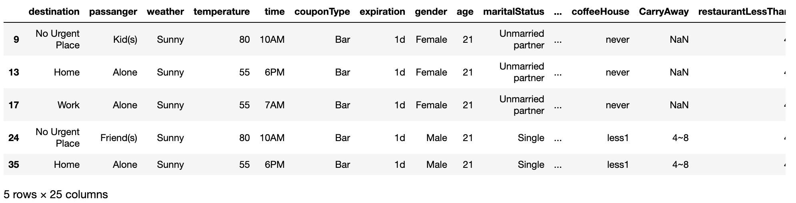
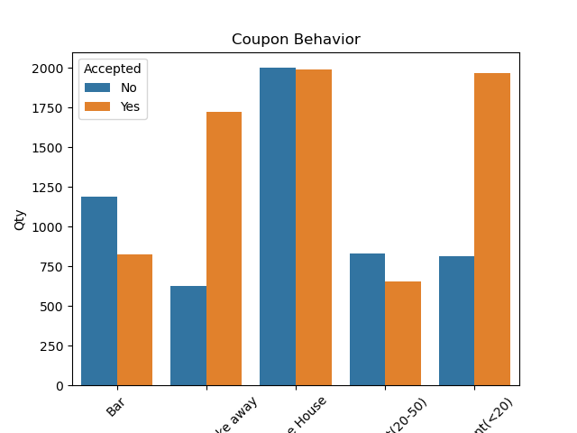
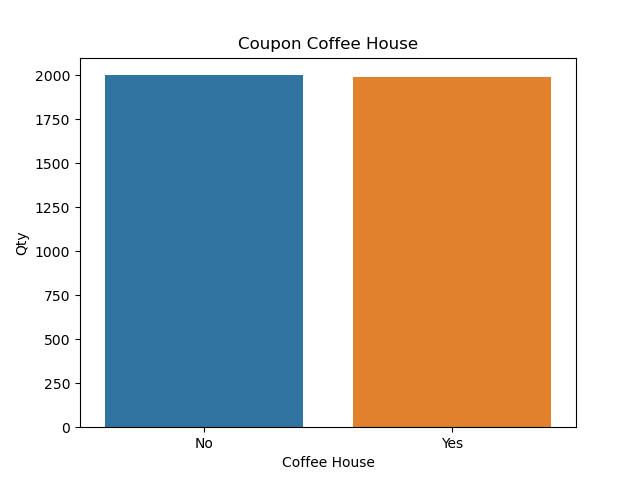
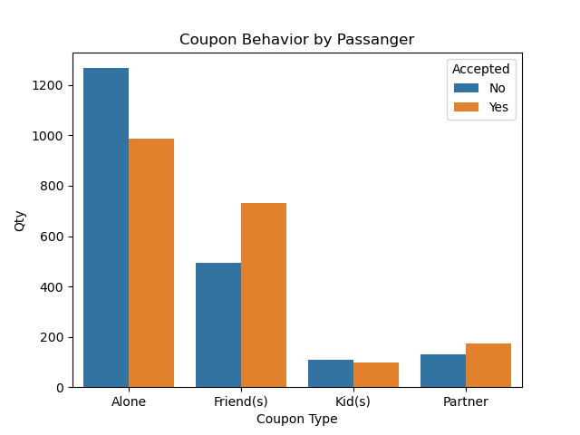
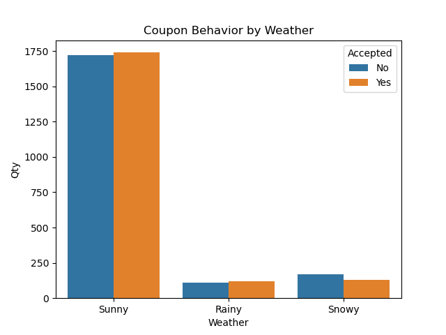
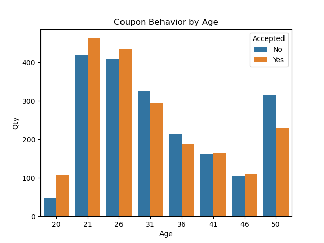
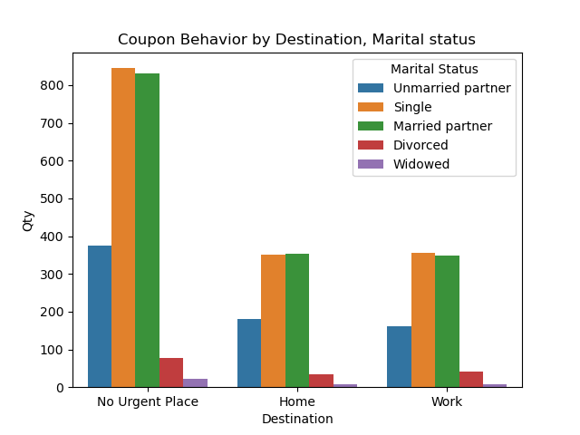

# Assignment 5.1 Coupon Investigation

### Independent Investigation

Using the bar coupon example as motivation, you are to explore one of the other coupon groups and try to determine the characteristics of passengers who accept the coupons.

### Overview:

for this practical exercise I have selected the type of coupon coffee house, because since I saw it in the graphs of the types of coupons I found it great behavior that is one of the most used but in turn is one of the most unacceptable so I want to explore more about it and see its behavior with some variables to help me understand their behavior.

### Conclusion 1
It is found that those who are most offered the coffee house coupon, but in proportion are also those who reject it the most, it seems that the driver offered more this type of coupon to single people. also the next in quantity is the passenger friends, which in proportion accept more than the rest, as well as the partners

### Conclusion 2
It seems that drivers offer more coffee house coupons when the days are sunny, and the behavior is quite similar to single people are rejected and accepted in equal proportion.

### Conclusion 3
When we verify the behavior of the coupons for coffee house in age range, we can see that in a range of 21 to 31 years old, most of these coupons are offered with a fairly balanced behavior in the acceptances, this can give us an idea that young people are the ones who most use this type of coupons and we see a slight upturn in the age range of 50 years old.

### Conclusion 4
As expected after analyzing the data according to the destination of the people, this coupon is more used when people do not have any urgency to go somewhere, also as we have been analyzing the other coupons are more used by people who are single or married.

### Next steps
*1. We should seek to improve the data sets by making them in ranges that are easier to understand and in segments that have a much more correlated meaning to the field. A clear example would be to define age ranges such as youth, young adults, adults, older adults. 

*2. It would be interesting to begin to review a little more data that were not explored such as education, occupation, direction_same, direction_opp, looking if any pattern of information can lead us to new findings of the behavior of the coupons.

### Final Notes
I think the exercise has been very interesting and has put into practice much of what we have been developing in the classes, I also really liked to understand how is the behavior of this type of coupon that being the most offered by the driver and have a fairly balanced acceptance I was very interested to know why and if at some point something made the driver to take this behavior.
